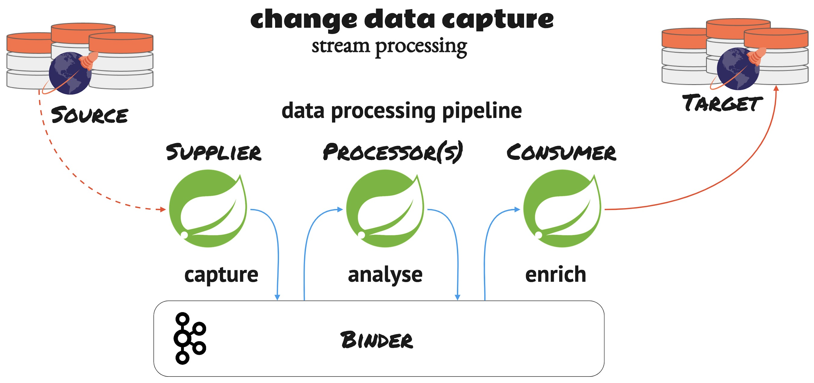

# CDC in YugabyteDB using Spring Cloud Data Streams

CDC streams to consume, analyse and enrich data from (point) a to (point) b to (point) z.

It is based on [spring-cloud-stream](https://docs.spring.io/spring-cloud-stream/docs/current/reference/html/) integration framework to provide an easy-to-use, consistent developer experience to capture, analyze and enrich data processing pipelines acros different systems.

## Business case: Flight Schedule API

Capture the flight schedule change event in real-time from the source system through CDC. Send it to a processing pipeline that applies specific business rules based on the arrival and departure time delay to send notifications to the appropriate internal servicing units such as ground-ops, crew-ops, etc. Similarly, we can extend it to other source events to build the complete flight-ops real-time notification data processing pipeline using CDC.

We use the following services to build the data streaming pipelines:
* YugabyteDB YSQL is the source database that generates the flight schedule
* [flightschedule](flightschedule) stream supplier captures the flight schedule change events using debezium source, and streams them through a Kafka binder topic (flight_ops)
* [flightops](flightops) gets the schedule change events from the flight_ops topic, runs the rule processing, populates the notification event, and streams them through a Kafka binder topic (flight_watch)
* [flightwatch](flightwatch) gets the notification events from the flight_watch topic and persists them in the target database
* YugabyteDB YCQL is the target database to keep the notification events.



## Devx

To have a better getting started experience, we have added the Gitpod support to try this out yourself with a single click. You don't need to make any of the infrastructure components. All you need is to fork the source repo and launch the Gitpod terminal using the browser plugin.


### CDC event flow from YSQL to YCQL
Run the following command from `1aa-ysql-shell`:
```sql
insert into flight_schedule values('YB524', current_date, 'SIN', 'IND', now()::timestamp, (now()+interval '20 minutes')::timestamp, (now()+interval '20 minutes')::timestamp, (now()-interval '120 minutes')::timestamp, (now()-interval '90 minutes')::timestamp, (now()-interval '120 minutes')::timestamp, 'T4', 'T4');
```

Run the following command from `1ab-ycql-shell` to verify the changes:
```sql
SELECT * FROM flight_watch;
```